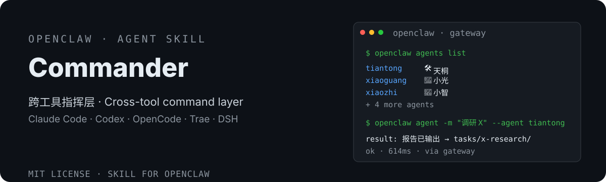

# OpenClaw Cross-Tool Commander 🎛️

<div align="center">
  <strong>🇨🇳 中文</strong> | <a href="README.en.md">🌐 English</a>
</div>

<p align="center">
  
</p>

> 让任意支持 Agent Skills 的工具指挥小遥Claw / OpenClaw 多 agent 系统。
> Cross-tool command layer — drive your XiaoyaoClaw/OpenClaw gateway from Claude Code, Codex, OpenCode, Trae, DSH and any Agent Skills tool.


[](https://clawhub.ai/dtsola/skills/xiaoyaoclaw-commander)

## 为什么需要它

Claude Code、Codex、OpenCode、Trae、DSH 等智能体工具能帮你写代码、跑任务，而你的 OpenClaw / 小遥Claw 里住着一群 agent（天桐、小光、小智……）和多条通道（飞书、Telegram……）。**想让外部智能体直接指挥 OpenClaw**，会遇到：

- ❌ **找不到命令**：openclaw 不在 PATH（桌面版内嵌在应用目录），直接敲报 not found
- ❌ **看不到真实 agent**：环境变量缺失，`agents list` 只剩 `main`，7 个 agent 全隐身
- ❌ **任务跑错人**：不指定 `--agent` 时按默认 agent 兜底，任务可能发错对象
- ❌ **路径写死**：换了安装位置/平台，写死的路径就失效

这个 skill 提供**标准化的指挥通道**：动态探测 + 环境变量补齐 + 强制显式 agent + 跨工具通用——任何支持 Agent Skills 的工具都能一键指挥 OpenClaw / 小遥Claw。

## 特性

- 🔍 **动态探测**：Windows / macOS / Linux 多级探测 openclaw 可执行文件（小遥桌面版 → PATH → 原版桌面版 → 本地前缀），不写死路径
- 🧩 **环境变量自动补齐**：桌面版安装场景自动推导 `OPENCLAW_STATE_DIR` / `OPENCLAW_CONFIG_PATH`，让外部工具看到全部真实 agent
- 🎯 **强制显式 agent**：`--agent` 必须指定——用户没说让谁干时先问，禁止默认兜底
- 🌐 **agent 名称动态映射**：中文/英文/emoji 名称 ↔ id 以 `agents list` 的 Identity 字段为权威，匹配不到就问，不猜
- 🧰 **跨工具通用**：兼容任何支持 Agent Skills 标准的工具（Claude Code / Codex / OpenCode / Trae / DSH 等），命令完全通用
- 🔌 **版本无关**：旧版 openclaw（v2026.3.x）无 `mcp`/`migrate` 子命令也能用，以 `--help` 实际输出为准
- 🛡️ **不存凭据**：技能内不存任何 token/密钥，Gateway 凭据由环境继承

## 安装

```bash
# 从 GitHub 手动安装
git clone https://github.com/dtsola/xiaoyaoclaw-commander
# 把 SKILL.md 所在目录复制到你的工具的技能目录：
#   Claude Code → ~/.claude/skills/
#   Codex       → ~/.codex/skills/
#   其他工具    → 对应 Agent Skills 目录
```

> 无需安装到 OpenClaw 的 skills 目录——本技能是给**外部工具**指挥 OpenClaw 用的。

## 使用

1. 把 skill 放到你的工具技能目录（Claude Code / Codex / OpenCode / Trae / DSH 等）
2. 对工具说「**让天桐调研 X**」「**让 OpenClaw 给飞书发消息**」等，技能会自动：
   - 探测 openclaw 可执行文件 + 补齐环境变量
   - 用 `agents list` 把智能体名称映射到 id
   - 经 Gateway 执行任务 / 发消息 / 查状态
3. 查询类指令：「OpenClaw 里有哪些 agent」「网关健康吗」

## 🚀 快速上手（三步，5 分钟）

### Step 1：安装技能

```bash
git clone https://github.com/dtsola/xiaoyaoclaw-commander
# Windows: 复制到 %USERPROFILE%\.claude\skills\xiaoyaoclaw-commander\
# macOS:   复制到 ~/.claude/skills/xiaoyaoclaw-commander/
```

### Step 2：让 agent 干活

对你的 Claude Code / Codex 说：

> 让天桐调研一下 xiaoyaoclaw 生态的发布流程

工具自动完成：探测 openclaw → 补齐环境变量 → `agents list` 映射「天桐」→ tiantong → `openclaw agent -m "..." --agent tiantong --json` → 返回结果。

### Step 3：验收 + 其他能力

- 查 agent 列表：说「OpenClaw 里有哪些 agent」→ `openclaw agents list`（含中文名 Identity）
- 通道发消息：说「让 OpenClaw 给飞书发消息：xxx」→ `openclaw message send --channel feishu -t <id> -m "..."`
- 查状态：说「OpenClaw 网关健康吗」→ `openclaw health`

### 日常使用习惯

| 场景 | 动作 |
|---|---|
| 让指定 agent 干活 | 说「让 <名称> 做 X」→ 自动映射 id 执行 |
| 跨通道通知 | 说「经飞书/Telegram 发消息」→ `message send` |
| 多人协作 | 先 `agents list` 看有哪些 agent 可用 |
| 不确定 agent 名称 | 技能会先查 Identity 再确认，不会猜 |

## 与其他方案的区别

| | 终端手动敲 | openclaw mcp serve | **OpenClaw Cross-Tool Commander** |
|---|---|---|---|
| 二进制定位 | 手动找，易踩坑 | 需新版 runtime | ✅ 动态探测，不写死 |
| 环境变量 | 手动设置 | 需配置 | ✅ 自动补齐 |
| runtime 版本 | 任意 | 需 v2026.8+ | ✅ 任意版本 |
| agent 选择 | 默认兜底易跑错 | 需自己处理 | ✅ 强制显式 + 名称映射 |
| 多工具支持 | 仅终端 | 仅 MCP client | ✅ 任意 Agent Skills 工具 |
| 技能标准 | — | — | ✅ Agent Skills 开放标准 |

## 目录结构

```
xiaoyaoclaw-commander/
├── SKILL.md                    # 技能主体（探测 + 环境变量补齐 + 命令手册）
├── docs/
│   ├── DESIGN.md               # 设计方案
│   ├── research-report-claude-code-openclaw.md   # 调研报告
│   └── research-00-problem-decomposition.md      # 问题拆解
├── README.md
└── LICENSE
```

## License

MIT — 随便用，署名可选。

---

## 🛠️ 需要定制？

**Agent & Skills 定制，价格 ¥800 起。**

- 微信：`dtsola`（添加好友时备注：**openclaw定制**）
- 服务范围：OpenClaw 多 agent 部署 / 工作区规范化 / 自定义 Skill 开发 / agent 记忆系统搭建

## 💬 加入交流群

小遥全系产品用户交流群——产品反馈 · 使用交流 · 功能建议：

<p align="center">
  
</p>

<p align="center">扫码加群，或添加微信 <code>dtsola</code>（备注：<b>加群</b>）</p>

## 姊妹项目

- 🏠 **xiaoyaoclaw-workspace-initializer**（工作区初始化器）：给每个 agent 一个「家」——标准目录结构 + WORKSPACE.md 规范 + 多 agent 配置安全。<https://github.com/dtsola/xiaoyaoclaw-workspace-initializer>
- 🧠 **xiaoyaoclaw-memory-distill**（记忆蒸馏）：把对话蒸馏成结构化记忆——语义分级（核心→MEMORY.md / 日常→日志）+ 首次建忆 + 增量去重 + 敏感跳过。<https://github.com/dtsola/xiaoyaoclaw-memory-distill>
- 🗂️ **xiaoyaoclaw-task-progress-tracker**（任务进度跟踪器）：目录即容器，PROGRESS.md 即进度——tasks/ 与 projects/ 生命周期管理（状态 + 进度日志 + 文档索引）。<https://github.com/dtsola/xiaoyaoclaw-task-progress-tracker>
- 📚 **xiaoyaoclaw-kb-retriever**（知识库检索器）：本地知识库检索——分层 data_structure.md 索引导航 + 渐进式检索（md/pdf/xlsx），零依赖零 API key，Windows / macOS 双平台。<https://github.com/dtsola/xiaoyaoclaw-kb-retriever>
- 🩹 **xiaoyaoclaw-workspace-auditor**（工作区体检）：只读审计 5 类健康度 + 分级报告 + 修复建议，零依赖脚本永不改文件。<https://github.com/dtsola/xiaoyaoclaw-workspace-auditor>
- 📎 **xiaoyaoclaw-web-clipper**（网页剪藏）：把任意网页保存为带 frontmatter 的本地 Markdown——双引擎正文提取（readability + trafilatura 降级链）、中文文件名安全、批量剪藏 + 去重；输出直通 knowledge/clippings/，配合 kb-retriever 建索引即可检索。<https://github.com/dtsola/xiaoyaoclaw-web-clipper>
- 🤝 **xiaoyaoclaw-agent-orchestrator**（Agent 协作编排，**协作层**）：拆任务、分 agent、管进度、聚结果、失败重试。<https://github.com/dtsola/xiaoyaoclaw-agent-orchestrator>
- 📊 **xiaoyaoclaw-usage-report**（用量报告）：解析 session JSONL，回答「每次 agent 任务花了多久、用了哪些工具/技能/模型、消耗了多少 token」——零依赖纯本地，token 为主指标。<https://github.com/dtsola/xiaoyaoclaw-usage-report>
- 🎛️ **xiaoyaoclaw-commander**（OpenClaw Cross-Tool Commander，**指挥层**）：本技能——让任意支持 Agent Skills 的工具指挥小遥Claw / OpenClaw 多 agent 系统。<https://github.com/dtsola/xiaoyaoclaw-commander>
- 🔍 **xiaoyaoclaw-seo-skill**（SEO 技能）：网站搜索可见性分析与优化——audit（技术SEO）/page（页面）/content（内容质量）/schema（结构化数据）/geo（AI搜索优化）五流程 + 零依赖审计脚本，跨工具通用。<https://github.com/dtsola/xiaoyaoclaw-seo-skill>

## 